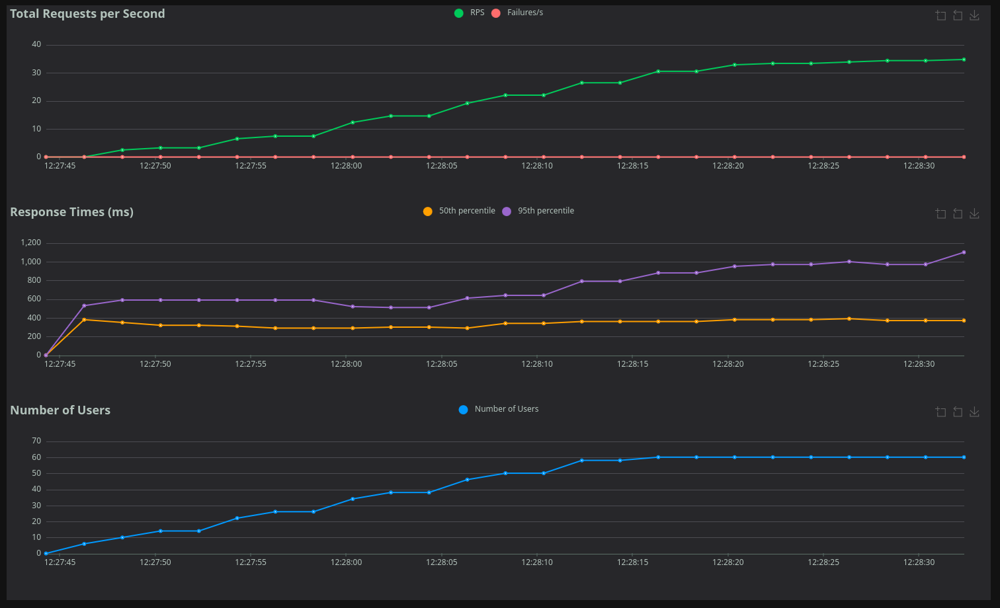

# Atlas performance tests
This repository contains a resources and test cases necessary for executing
performance tests against Atlas REST API. The Atlas is instance of the
TPA (Trusted Profile Analyzer).

## How to run tests
Before running a tests a user needs to provide necessary env variables in order
to get a proper access to the API.

```bash

export CLIENT_ID="<client ID>"
export CLIENT_SECRET="<secret>"
export TOKEN_URL="https://auth.stage.redhat.com/auth/realms/EmployeeIDP/protocol/openid-connect/token"
```

Use a predefined `Makefile` to run an automated tests suite. The makefile install all dependencies,
init a data in Atlas and execute tests using [Locust](https://locust.io/) framework.

```bash
make
```

By default test suite uses a stage environment of the Atlas. If you want to test against
different instance you need to set following vars.

```bash
export BOMBASTIC_HOST="https://bombastic.example.com"
export VEXINATION_HOST="https://vexination.example.com"
```

### Review results in UI
The locust framework provides a visualization that reflects a test cases and results.
Test can be executed using
```bash
make run-ui
```

to make UI available at `http://0.0.0.0:8089`.

### Results
Each test run produces a stats and metrics into `./results` directory that can be used
to determine right SLOs.

The UI also provides a visualization with a metrics:

